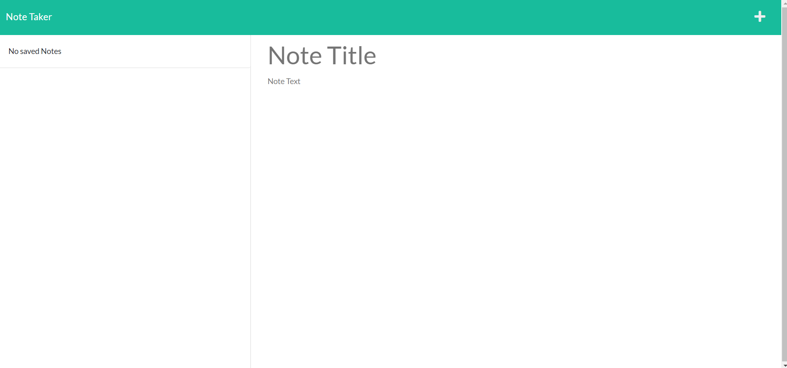

# Note Taker

  

  ## Table of Contents
  - [Description](#Description)
  - [Screenshot] (#Screenshot)
  - [Installation](#Installation)
  - [Usage](#Usage)
  - [Deployment](#Deployment)
  - [Tests](#Tests)
  - [License](#License)
  - [Questions](#Questions)

  ## Description
  This project allows you input notes into the website to view whenever you like. Upon reaching the website and pressing the button on the landing page, the user can make a new note by pressing the plus in the top right corner. After filling in a title for the note and typing the note into the body, the user can then click the save icon in the top right, and the note will be saved, able to be accessed on the left side of the application.

  ## Screenshot
  

  ## Installation
  Open in integrated terminal, then type npm i.

  ## Usage
  Open in integrated terminal, then type npm start. Then open http://localhost:3001/ in your browser.

  ## Deployment
  Deployed to Heroku at https://note-taker-cwish.herokuapp.com/

  ## Tests
  N/A

  ## License
  
   
  This application uses no license.

  ## Questions
  You can contact me for questions at my [email](mailto:cwishart203@gmail.com), or you can go to my [GitHub](https://github.com/cwishart203).

  ## Addtional Contributors
  N/A
